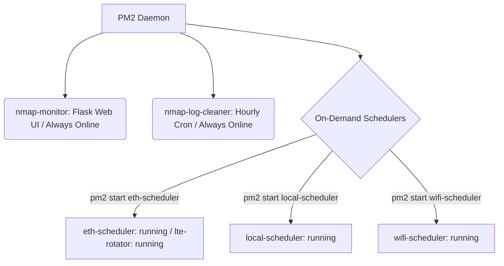
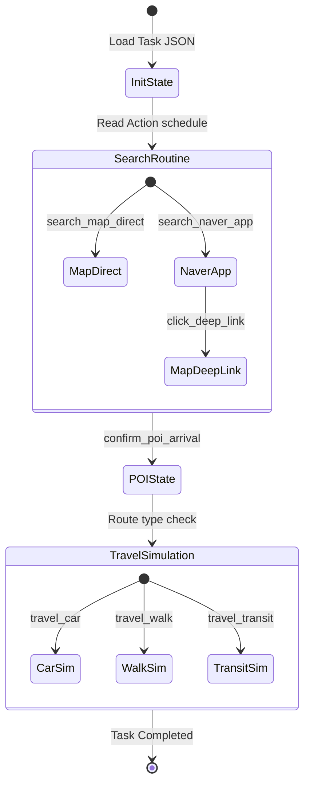

# Nmap Multi-Proxy System: Unified Enterprise Architecture Plan (V2)

This document outlines the architecture, directory structure, and execution flow for **Nmap Multi V2**. This plan consolidates the redundant `wifi_multi`, `eth_multi`, and `local_multi` folders into a single, flag-configured codebase, integrates device initialization, adds Android 14/15 system CA bypass hooks, and enables multi-modal travel actions (car, walk, transit) through a structured state machine.

---

## 1. Directory Structure (Refined with `src/` & Root Entry Scripts)

To eliminate redundant ADB iteration scripts and consolidate device commands, all phone-specific controls (e.g. rebooting, checking IPs, checking app versions, patching, disabling carrier data) are unified under the root `cmd.sh` and `src/lib/adb.py`. This leaves `tools/` containing only pure server-side network and diagnostics helpers.

```text
nmap_multi_v2/                 # Project version is managed at directory level
├── docs/                      # Architectural design and API documentation
│   ├── architecture_v2_plan.md# This plan
│   └── file_audit_and_reorganization_plan.md
├── config/                    # Global settings & device mappings
│   ├── global.conf            # Runtime switches (default mode, stagger delay)
│   ├── devices.json           # Unified device configuration (IME, model overrides)
│   └── network_mapping.json   # Modems (lte11~20) and device routing groups
├── src/                       # Consolidated Source Code Root
│   ├── lib/                   # Utility helpers & shared libraries
│   │   ├── __init__.py
│   │   ├── adb.py             # Safe ADB execution, concurrent device commands, Z Flip open check
│   │   ├── reporter.py        # API log transmission, file lock scoring
│   │   ├── check_signals.py   # Refactored dynamic IPv4 PBR diagnostic library
│   │   └── shell_helpers.sh   # Shared bash utility functions
│   ├── core/                  # Orchestration & proxy execution engines
│   │   ├── init_pipeline.py   # Integrated first-run device initialization (--init)
│   │   ├── proxy_manager.py   # reverse ADB tunnels, mitmproxy (connect_addr), frida
│   │   ├── web_monitor.py     # Flask web dashboard (Always Online)
│   │   └── scheduler.py       # Main loop scanner (Subnet lock, cooldown checks)
│   ├── mitm/                  # Mitmproxy scripts (addon.py, whitelist.py)
│   ├── frida/                 # Instrumentation scripts (bypass_ssl.js, network_hook.js)
│   └── macro/                 # Macro automation modules (State-Machine)
│       ├── __init__.py
│       ├── executor.py        # Action list dispatcher
│       ├── type_helper.py     # ADB Keyboard text humanizer
│       ├── ui_clicker.py      # Screen layout coordinate Clicker
│       └── actions/           # Extensible travel modes & search routines
├── tools/                     # Unified Utilities & Diagnostics (Server-Side Helpers Only)
│   ├── scrcpy/                # Screen mirror & sync control GUI scripts
│   ├── adb_recovery.py        # ADB connectivity watchdog
│   ├── check_speeds.sh        # Network link speed tester
│   ├── check_usb_limits.sh    # Host USB hub controller current/bandwidth inspector
│   ├── fix_lte_interfaces.sh  # Huawei modem interface order corrector and PBR runner
│   ├── clean_logs.sh          # Log rotating and clean cron script
│   ├── sync_modems.sh         # Synchronize LTE modem states
│   └── sync_nmap_drive.sh     # GDrive asset sync script
├── logs/                      # Segmented Logging Directory
│   ├── system/                # Scheduler, Rotator, and Web Dashboard core logs
│   ├── network/               # mitmproxy packet intercepts & traffic usage logs
│   ├── init/                  # Device initialization (--init) logs (Date/Time/DeviceID)
│   │   └── YYYYMMDD/HHMMSS/DeviceID/
│   ├── macro_car/             # Car navigation macro simulation logs (Date/Time/DeviceID)
│   │   └── YYYYMMDD/HHMMSS/DeviceID/
│   └── macro_walk/            # Pedestrian navigation macro simulation logs (Date/Time/DeviceID)
├── start.sh                   # Main entry script (Master CLI wrapper - e.g., ./start.sh --mode eth)
├── install.sh                 # Consolidated server dependency installer & network setups
└── cmd.sh                     # Unified ADB broadcast & concurrent phone management CLI
```

---

## 2. PM2 Services & Registration Architecture

PM2 is used strictly for registering and managing process lifecycles. There are no command wrappers or abstractions hidden inside `start.sh`. The user controls the registered PM2 processes directly using standard, explicit `pm2` command-line tools.



### PM2 Process Definitions (Registered via install.sh)
1. **`nmap-monitor` (Always ONLINE)**
   - **Script**: `src/core/web_monitor.py`
   - **Description**: Serves the Flask web control panel showing device statuses. Runs continuously.
2. **`nmap-log-cleaner` (Always ONLINE - Cron)**
   - **Script**: `tools/clean_logs.sh` (Cron: `0 * * * *` - hourly)
3. **`eth-scheduler` & `eth-ip-rotator` (Default STOPPED)**
   - **Script**: `start.sh --mode eth` & `src/core/modem_rotator.py`
4. **`local-scheduler` (Default STOPPED)**
   - **Script**: `start.sh --mode local`
5. **`wifi-scheduler` (Default STOPPED)**
   - **Script**: `start.sh --mode wifi`

---

## 3. Root Master CLI Scripts

To keep the root folder minimal and intuitive, three master scripts are placed at the root level, redirecting sub-commands to their respective files under `tools/` and `src/`.

### A. `start.sh` (Master Run Script)
Handles foreground execution, checks diagnostics, or serves as the execution target for PM2 processes:
```bash
# Foreground / PM2 Target Runs
./start.sh --mode eth          # Launches scheduler using LTE PBR routing
./start.sh --mode local        # Launches scheduler using PC default gateway
./start.sh --mode wifi         # Launches scheduler using wireless multi-gateway

# Diagnostics & GUI
./start.sh --signals           # Launches check_signals.py diagnostic table
./start.sh --gui               # Opens scrcpy sync mirror controls
```

### B. `install.sh` (Consolidated Server/Device Setup & PM2 Config)
Orchestrates dependency installs, server settings, and registers PM2 processes:
```bash
./install.sh --server          # Installs dependencies, setup PBR, & registers PM2 template (Stopped state)
./install.sh --download        # Downloads the targeted Naver Map APK version
```

### C. `cmd.sh` (Unified ADB Broadcaster & Concurrent Device Controller)
Instead of executing individual shell scripts under `tools/`, the root `cmd.sh` calls the concurrent Python executor in `src/lib/adb.py` to execute tasks in parallel across all 60 devices:
```bash
# Custom Commands Broadcast
./cmd.sh "input keyevent 224"            # Wake screens
./cmd.sh "am force-stop com.nhn.android.nmap" # Force close Map app on all devices

# Structured System Sub-commands
./cmd.sh --reboot                        # Safely reboot all phones sequentially
./cmd.sh --wifi "Tech_5G"                # Wipe old Wi-Fi profiles and connect to Tech_5G
./cmd.sh --dark | --light                # Toggle system display mode on all devices
./cmd.sh --portrait                      # Lock screen to vertical portrait mode
./cmd.sh --app-version                   # Audit installed Naver Map versions
./cmd.sh --wifi-ips                      # Show assigned wlan0 IP addresses
./cmd.sh --disable-usim                  # Disable cellular connection
./cmd.sh --patch-app                     # Ingest dynamic hosts and frida overrides
./cmd.sh --emergency                     # Instantly exit execution and return home
```

---

## 4. Lifecycle-Based Log Management

Logs are structured strictly by **category/phase** first, and then organized hierarchically by **Date/Time/DeviceID**. This avoids mixing system core logs with device automation runs, and handles logging without status directories, since task completion state is only determined post-execution.

```text
logs/
├── init/                      # Device registration phase
│   └── YYYYMMDD/HHMMSS/DeviceID/
├── macro_car/                 # Car driving macro execution phase
│   └── YYYYMMDD/HHMMSS/DeviceID/
├── macro_walk/                # Walking macro execution phase
│   └── YYYYMMDD/HHMMSS/DeviceID/
├── system/                    # Rotators, web dashboard logs
└── network/                   # mitmproxy dump logs
```

---

## 5. Android 14 & 15 Extensibility Adapter

In Android 14 and 15, system security properties restrict standard CA injection and Frida attachment. V2 addresses this using version-specific adapters.

### The APEX Certificate Namespace Block
In Android 14/15, the System CA storage directory `/system/etc/security/cacerts` has been moved to the APEX module namespace `/apex/com.android.conscrypt/cacerts/` which is read-only and mount-namespace isolated.

### V2 Conscrypt Overlay Bypass
`src/frida/version_adapters/android_14_15.js` performs dynamic memory hooks on `libconscrypt.so` to inject the mitmproxy CA certificate directory directly during SSL context initialization:

```javascript
// Pseudocode for Android 14/15 conscrypt memory injection
Interceptor.attach(Module.findExportByName("libconscrypt.so", "SSL_CTX_new"), {
    onEnter: function(args) {
        // Force injection of custom CA directory into the active trust manager
    }
});
```

`src/core/proxy_manager.py` queries `ro.build.version.release` via ADB and loads the matching Frida script and initialization sequence automatically:

```python
# Dynamic version adaptor
android_version = adb.get_build_version(device_id) # e.g. 14 or 15
if android_version >= 14:
    frida_script = "src/frida/version_adapters/android_14_15.js"
    # Perform temp mount overlays for /apex namespaces
else:
    frida_script = "src/frida/version_adapters/android_12_13.js"
```

---

## 6. Multi-Modal Action State Machine

The macro executor is refactored into a declarative **state machine** mapped to modules inside `src/macro/actions/`. This enables seamless expansion into walking, public transit, and Naver Search app integration.

### Structured Action Model (`action_schedule.json`)
```json
{
  "task_types": {
    "car_direct": [
      "search_map_direct",
      "confirm_poi_arrival",
      "travel_car"
    ],
    "walk_direct": [
      "search_map_direct",
      "confirm_poi_arrival",
      "travel_walk"
    ],
    "search_app_car": [
      "search_naver_app",
      "click_deep_link",
      "confirm_poi_arrival",
      "travel_car"
    ]
  }
}
```



---

## 7. Implementation and Safety Plan

To prevent any impact on the live production environment, development will follow these guidelines:

1. **Workspace Isolation**:
   - All code edits for V2 must occur strictly inside `/home/tech/nmap_multi_v2/`.
   - Production logs under `eth_multi/logs/` or `local_multi/logs/` will remain completely unaffected.
2. **Consolidated Testing**:
   - V2 scheduler can be tested on a single test device using `./start.sh --mode local --device <test_id>` without launching the daemon system-wide.
3. **Transition**:
   - Once V2 is verified stable, the entire directory can be safely moved to `/home/tech/nmap_multi_v2/` and registered under PM2, updating active jobs.
